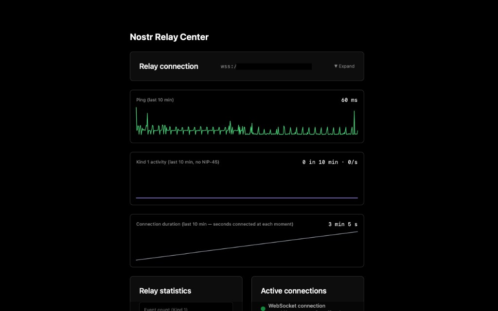

# Nostr Relay Center



A Progressive Web App (PWA) to manage a Nostr relay: connect via WebSocket, view NIP-11 metadata (fees, posting policy, relay countries), optional NIP-45 event count and recent activity, and manage a whitelist by publishing signed Kind 25000 events. **Authentication:** NSEC with PIN-protected encryption (Web Crypto API) in the browser, or **Nostr Bunker (NIP-46)** for remote signing. Layout: latency and connection-duration charts at the top, then statistics and relay overview, session and log out at the bottom. Minimal UI with light/dark theme.

## Requirements

- **Node.js** 18+
- **npm** (or yarn/pnpm)
- A **Nostr relay** (e.g. [nostr-rs-relay](https://github.com/scsibug/nostr-rs-relay)) that supports:
  - WebSocket (Nostr protocol)
  - NIP-11 (metadata at `/.well-known/nostr.json`)
  - Optionally: NIP-45 (COUNT) for event counts, and interpretation of **Kind 25000** for whitelist (see [Relay compatibility](#relay-compatibility))

## Panel access

To use the admin panel you need:

1. **Authentication**  
   Either **NSEC** (local key, encrypted in the browser with a 6-digit PIN) or **Nostr Bunker (NIP-46)** (e.g. bunker URL or NIP-05). Without login you only see the login screen.

2. **Relay reachable from the browser**  
   - The relay must be reachable via **WebSocket** (ws/wss) (CORS/network/firewall).
   - For NIP-11 metadata the relay URL is fetched over HTTP/HTTPS (same host as WebSocket); the relay or web server must serve `/.well-known/nostr.json` or the root URL with `Accept: application/nostr+json`.

3. **Relay URL**  
   Enter the relay WebSocket URL (e.g. `wss://relay.example.com`) when first using the app. The last used URL can be stored in local storage.

Without a relay connection only placeholders and “Connect to a relay” are shown; whitelist and other actions require an active connection.

## What to do

### 1. Clone and install

```bash
git clone <repository-url>
cd "Nostr Relay Center"
npm install
```

### 2. Run locally

```bash
npm run dev
```

Then open **http://localhost:3000** (or the URL shown in the terminal). No environment variables are required for local development.

### 3. Build for production

```bash
npm run build
```

Output is in `dist/`. Serve that folder with any static host (e.g. Nginx, Netlify, Vercel). For PWA “Add to Home Screen”, serve over HTTPS and ensure `manifest.json` and the icons under `icons/` are reachable.

### 4. Use the app

1. **Authenticate**  
   - **NSEC (local):** Enter your NSEC and a 6-digit PIN. The app encrypts the NSEC with the Web Crypto API (PBKDF2 + AES-GCM) and stores only the ciphertext in `localStorage`. First time: NSEC + PIN and save; next times: PIN only to unlock.  
   - **Nostr Bunker (NIP-46):** Use “Or connect with Nostr Bunker” and enter a bunker URL (e.g. `bunker://pubkey?relay=wss://...`) or a NIP-05 (e.g. `user@domain`). The app connects to the remote signer; your key never leaves the Bunker.

2. **Connect to a relay**  
   Enter the relay WebSocket URL (e.g. `wss://relay.example.com`). The app connects and fetches NIP-11 metadata.

3. **Dashboard**  
   - **Charts (top):** Latency (ping) curve (green) and connection duration (gray).  
   - **Relay statistics:** Kind-1 event count (if relay supports NIP-45) and recent Kind-1 activity.  
   - **Active connections:** WebSocket status.  
   - **Relay metadata (NIP-11):** Full relay metadata.  
   - **Whitelist:** Add pubkeys (hex or npub), optionally “Allow all”, and publish a signed Kind 25000 event. Only has an effect if your relay interprets Kind 25000 (see below).  
   - **Session:** At the bottom; log out and (when using Bunker) “Connected via Nostr Bunker (NIP-46)”.

4. **Theme**  
   Use the sun/moon toggle in the top-right to switch light/dark theme; the choice is stored in `localStorage`.

## Scripts

| Command           | Description                     |
|-------------------|---------------------------------|
| `npm run dev`     | Start dev server (Vite)         |
| `npm start`       | Same as `dev`                   |
| `npm run build`   | TypeScript check + prod build   |
| `npm run preview` | Serve `dist/` locally           |

## Tech stack

- **Vite** + **React** (TypeScript)
- **Tailwind CSS**
- **nostr-tools** (signing, nip19, **nostr-tools/nip46** for Bunker)
- **Web Crypto API** (PBKDF2, AES-GCM) for NSEC encryption
- State: **AuthContext** (NSEC + NIP-46), **RelayContext** (connection, ping, NIP-45 COUNT, recent subscription), **NIP11Context** (shared NIP-11 metadata)

## Project structure

```
src/
├── main.tsx, App.tsx, index.css
├── components/
│   ├── AppHeader.tsx          # Theme toggle + ping
│   ├── Auth/NSECAuth.tsx
│   ├── Relay/RelayConnection.tsx, RelayMetadata.tsx
│   └── Dashboard/AdminDashboard.tsx, ConnectionsList.tsx, RelayStats.tsx,
│       RelayLatencyChart.tsx, ConnectionDurationChart.tsx, WhitelistManager.tsx
├── contexts/                  # AuthContext, RelayContext, NIP11Context
├── hooks/                     # useRelay, useNIP11
├── services/relay.ts          # WebSocket, send event, measureRoundTrip, requestCount
├── utils/crypto.ts            # Encrypt/decrypt NSEC (PBKDF2, AES-GCM)
├── utils/storage.ts           # localStorage for encrypted NSEC
└── types/nostr.ts
```

## PWA

- **Manifest:** `public/manifest.json` (name “Nostr Relay Center”, short_name, icons, display standalone, theme_color).
- **Icons:** Add `public/icons/icon-192x192.png` and `icon-512x512.png` for “Add to Home Screen”.
- No service worker included; add one (e.g. vite-plugin-pwa) if you want offline caching.

## Security

- The NSEC is **never** stored in plain text. It is encrypted with a key derived from your PIN (PBKDF2, 100k iterations, SHA-256) and AES-GCM; salt and IV are generated per encryption and stored with the ciphertext.
- The PIN is only used in memory to decrypt; it is not stored anywhere.
- Use **wss://** in production so the WebSocket connection is encrypted.

## Relay compatibility

- **NIP-11** and **WebSocket** are standard; the PWA works with any Nostr relay that exposes `/.well-known/nostr.json` and accepts Nostr protocol messages.
- **NIP-45 (COUNT):** Event count for Kind 1 is shown when the relay supports NIP-45 COUNT. If the relay does not support it, “—” and a note are shown.
- **Whitelist UI:** The PWA uses NIP-11 `software` to decide whether to show the Kind 25000 whitelist UI. Relays that report `nostr-rs-relay` get “No NIP 25000 support”; others (strfry, nostream, custom) get the whitelist UI.
- **nostr-rs-relay:** Does **not** use Kind 25000 for access control. Whitelist is configured in `config.toml` under `[authorization]` → `pubkey_whitelist` (hex pubkeys).
- **Kind 25000 (whitelist):** The app can publish events like `{ kind: 25000, content: JSON.stringify({ allowed_pubkeys: [...] }), tags: [["d","whitelist"]] }` or `{ allow_all: true }`. This only takes effect if something interprets those events (e.g. a plugin or daemon that updates relay config).

## Extending

The app sends signed Nostr events (e.g. Kind 25000) to the relay. You can add more admin features by defining new event kinds that your relay or a bridge service understands. **AuthContext** exposes `signEvent(unsignedEvent)`; any component can request a signature via NSEC or NIP-46 and then send the event with **RelayContext**’s `sendRelayEvent`.

## License

Use and adapt as you like. No warranty.
